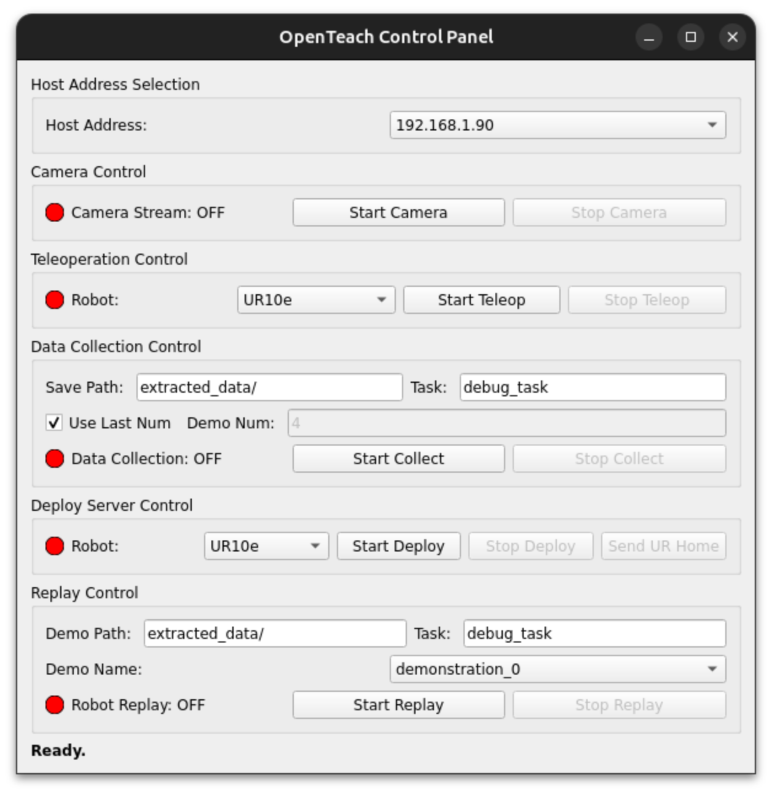

# HowTo GUI Application

For using the GUI application(`MainApplication.py`) for using camera launching, teleoperation, data collection, deploy and replay easily refer below steps:

1. Make sure you have followed all the installation steps mentioned in the [README](../README.md) file.
2. Launch the GUI application by running the following command in your terminal:

   ```bash
   python MainApplication.py
   ```
3. The GUI window will open, providing you with various options for camera launching, teleoperation, data collection, deployment, and replay.

If you connect to the UR10e workstation with ssh -X, the GUI will be displayed on your local machine.

## How it looks like:



### Host Address Selection

Choose 'host address' for camera, teleoperation and so on.
For teleoperation, address should be start with 192.
When you want to use AI model to control the robot, choose the address starting with 147.

### Camera Control

Click 'Start Camera' to launch the camera streams.
Sometimes realsense camera is busy, so you may need to click it multiple times.

### Teleoperation Contral

Choose your robot (actually, there is only one robot and that is the default setting for now...) and click 'Start Teleop' to start teleoperation.
Now you can control the robot with Meta Quest 3.

#### How to control?

- Left hand middle pinch(중지-엄지 맞대기): Start teleoperation
- Left hand ring pinch(약지-엄지 맞대기): Stop teleoperation
- Right hand index pinch(검지-엄지 맞대기): Open/Close gripper
- Right hand pinky pinch(새끼-엄지 맞대기): Send robot to home position

When robot start to move home position by right hand pinky pinch, control process will sleep for 5 seconds. 
I recommend you to stop teleoperation during this time. 
After 5 seconds and if you start teloperation again, controller will be reset to current right hand pose. 

### Data Collection

Save Path is the base directory for saving the collected data.
Task is the sub-directory under Save Path.
Collected data will be save under Save-Path/Task/demonstration_XX.
If use 'Use Last Num' option, Demo Num will be set as the biggest existing demo num + 1 under the Task directory.
Click 'Start Data Collection' to start data collection.
Click 'Stop Data Collection' after you finish collecting data.
I recommend you to stop teleoperation first before stopping data collection.

### Deploy Server Control

Choose your robot.
Click 'Start Deploy Server' to start deploy server.
When deploy server started, you can click 'Send UR Home' button to send UR10e robot to home position.
'Send UR Home' button will send robot to home position immediately and sleep for 3 seconds.
Click 'Stop Deploy Server' to stop deploy server.

You cannot run deploy server and teleoperation at the same time. 
One of them will occupy the robot controller.
Please make sure one of them is stopped before starting the other one.

### Replay Control

Similar to data collection, choose Demo Path and Task.
Then, Demo Name will be automatically listed in the combo box.
Choose the demo you want to replay.
Make sure Deploy Server is started before clicking 'Start Replay' button.
Also, make sure the robot is in the safe position (like home position) before starting replay.
You may use 'Send UR Home' button in Deploy Server Control to send robot to home position.
Click 'Start Replay' to start replaying the chosen demonstration.
Click 'Stop Replay' to stop replaying.